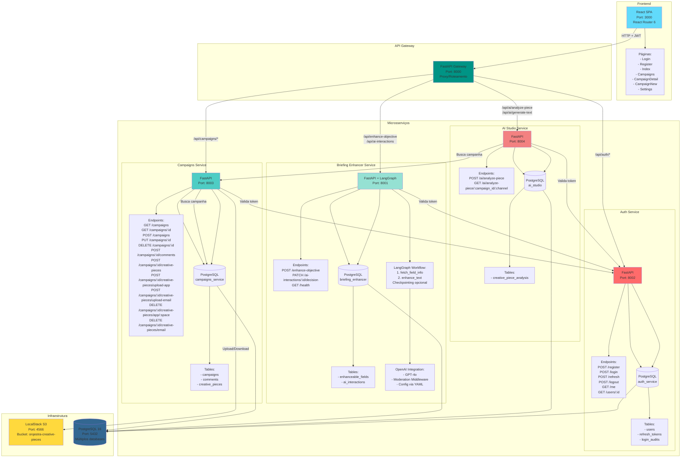
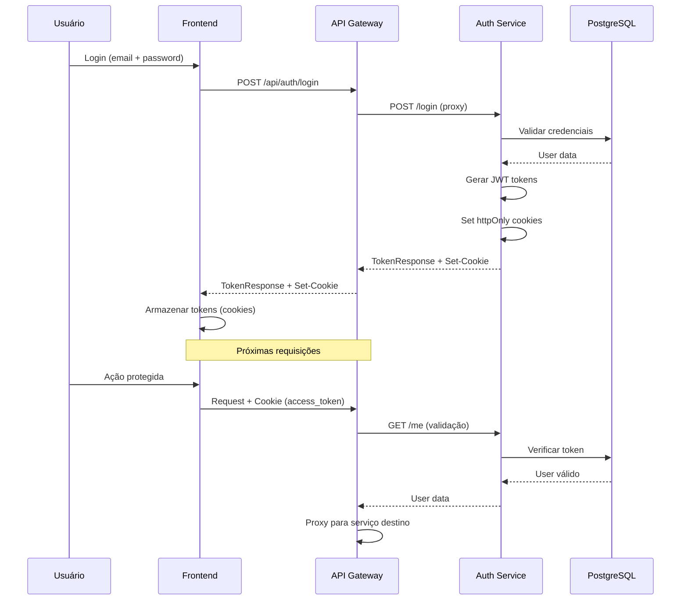
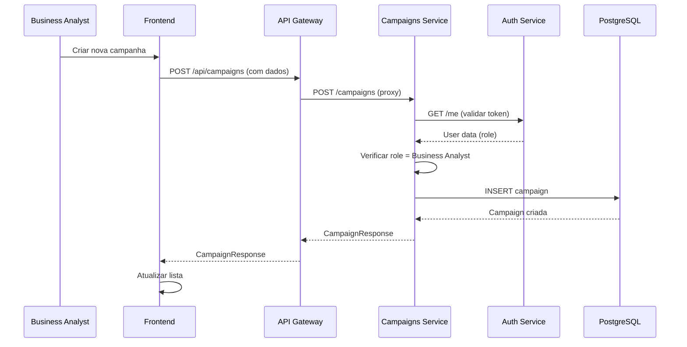
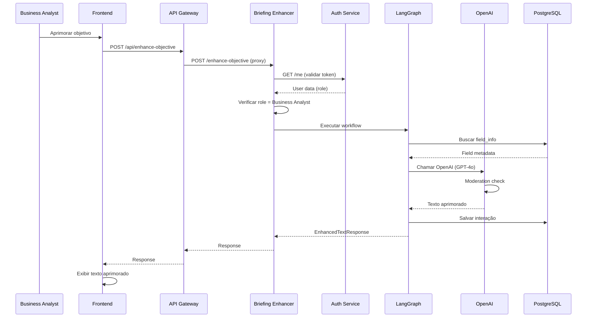
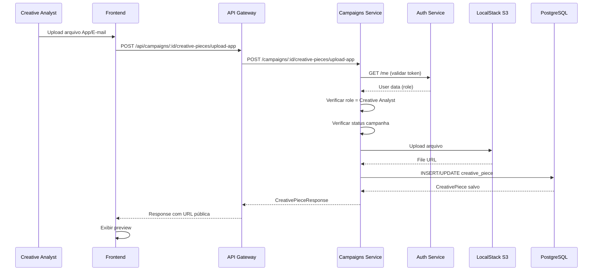
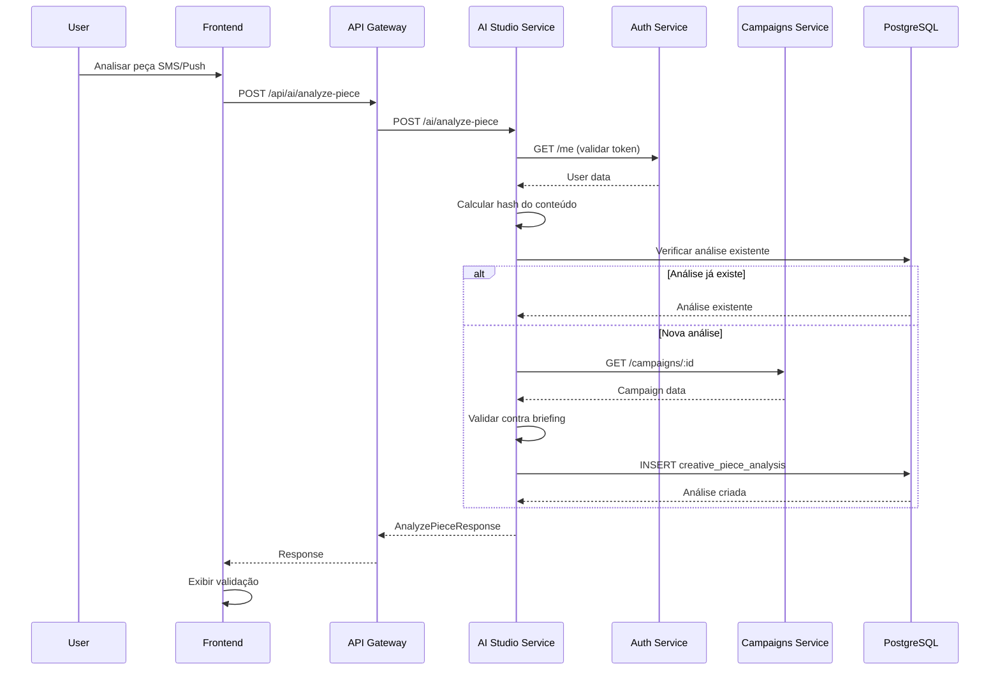

# Diagrama da Solução - Estado Atual da Implementação

## Arquitetura de Microsserviços

## Fluxo de Autenticação

## Fluxo de Criação de Campanha

## Fluxo de Aprimoramento de Texto (Briefing Enhancer)

## Fluxo de Upload de Peça Criativa

## Fluxo de Análise de Peça Criativa (AI Studio)

## Componentes Implementados

### Frontend (React)
- ✅ Sistema de roteamento (React Router 6)
- ✅ Páginas: Login, Register, Index, Campaigns, CampaignDetail, CampaignNew, Settings
- ✅ Proteção de rotas (ProtectedRoute)
- ✅ Integração com API Gateway
- ✅ UI Components (Radix UI + TailwindCSS)

### API Gateway
- ✅ Roteamento baseado em path
- ✅ Proxy transparente de requisições
- ✅ Repasse de headers de autenticação
- ✅ Repasse de cookies (Set-Cookie)
- ✅ Tratamento de erros e timeouts

### Auth Service
- ✅ Registro de usuários
- ✅ Login com JWT
- ✅ Refresh tokens
- ✅ Logout
- ✅ Validação de tokens (/me)
- ✅ Rate limiting
- ✅ Auditoria de login
- ✅ Cookies httpOnly

### Campaigns Service
- ✅ CRUD completo de campanhas
- ✅ Sistema de comentários
- ✅ Gerenciamento de peças criativas (App e E-mail)
- ✅ Upload de arquivos para S3
- ✅ Validação de permissões por role
- ✅ Workflow de status de campanha
- ✅ Integração com Auth Service

### Briefing Enhancer Service
- ✅ Aprimoramento de texto usando LangGraph
- ✅ Integração com OpenAI (GPT-4o)
- ✅ Moderation middleware
- ✅ Checkpointing opcional (LangSmith)
- ✅ Histórico de interações
- ✅ Decisões do usuário (approved/rejected)
- ✅ Configuração via YAML

### AI Studio Service
- ✅ Análise de peças criativas (SMS e Push)
- ✅ Validação contra briefing
- ✅ Cache por hash de conteúdo
- ✅ Integração com Campaigns Service
- ✅ Análise de validação (valid/invalid/warning)

### Infraestrutura
- ✅ PostgreSQL 16 (múltiplos databases)
- ✅ LocalStack S3 (armazenamento de arquivos)
- ✅ Docker Compose (orquestração)
- ✅ Health checks

## Comunicação Entre Serviços

| Origem | Destino | Propósito | Protocolo |
|--------|---------|-----------|-----------|
| Frontend | API Gateway | Todas as requisições | HTTP + JWT (cookies) |
| API Gateway | Auth Service | Roteamento /api/auth/* | HTTP |
| API Gateway | Campaigns Service | Roteamento /api/campaigns/* | HTTP |
| API Gateway | Briefing Enhancer | Roteamento /api/enhance-objective | HTTP |
| API Gateway | AI Studio | Roteamento /api/ai/* | HTTP |
| Campaigns Service | Auth Service | Validação de token | HTTP |
| Briefing Enhancer | Auth Service | Validação de token | HTTP |
| AI Studio | Auth Service | Validação de token | HTTP |
| AI Studio | Campaigns Service | Buscar dados da campanha | HTTP |
| Campaigns Service | LocalStack S3 | Upload/Download arquivos | S3 API |

## Bancos de Dados

### auth_service
- `users` - Usuários do sistema
- `refresh_tokens` - Tokens de refresh
- `login_audits` - Auditoria de logins

### campaigns_service
- `campaigns` - Campanhas
- `comments` - Comentários nas campanhas
- `creative_pieces` - Peças criativas (App, E-mail, SMS, Push)

### briefing_enhancer
- `enhanceable_fields` - Campos aprimoráveis
- `ai_interactions` - Histórico de interações com IA

### ai_studio
- `creative_piece_analysis` - Análises de peças criativas

## Tecnologias Utilizadas

- **Frontend**: React 18, TypeScript, Vite, TailwindCSS, Radix UI
- **Backend**: FastAPI, Python 3.11+
- **IA**: LangGraph, LangChain, OpenAI API
- **Banco de Dados**: PostgreSQL 16
- **Storage**: LocalStack (S3)
- **Orquestração**: Docker Compose
- **Autenticação**: JWT, httpOnly cookies

