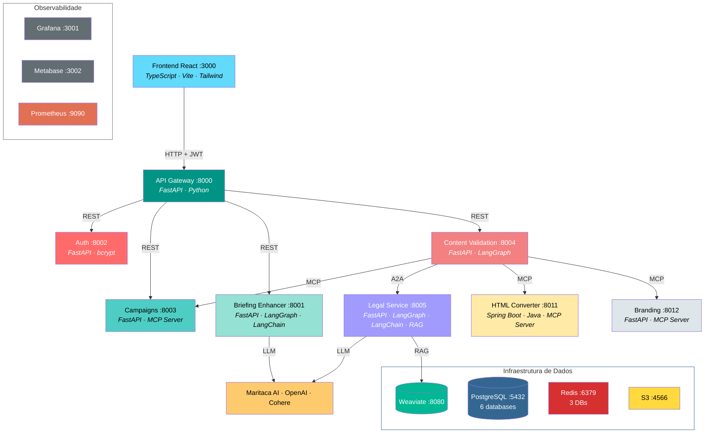
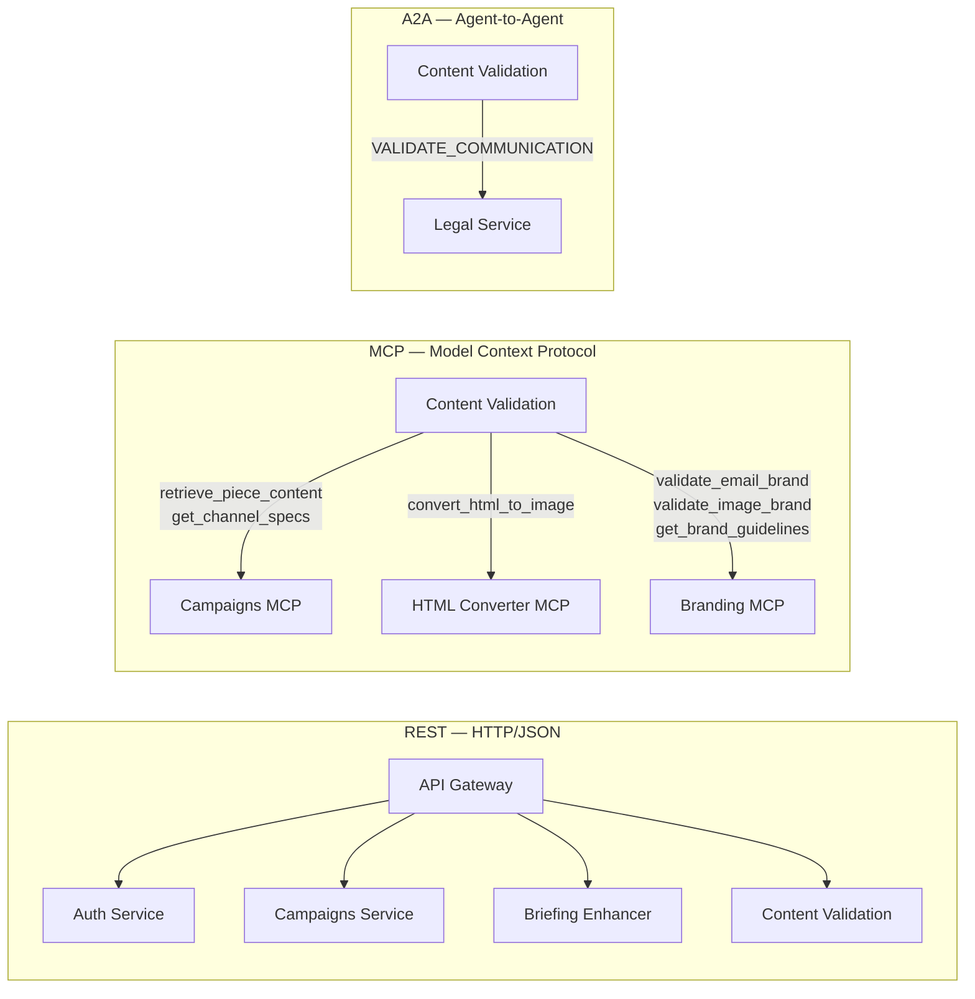
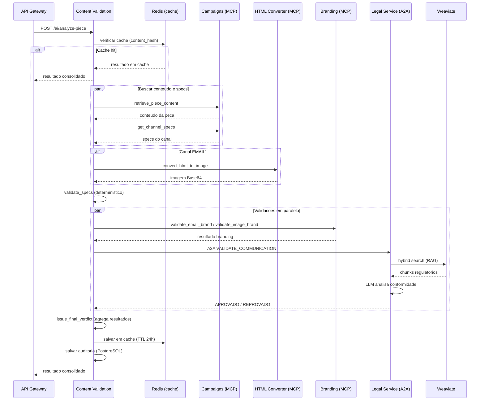
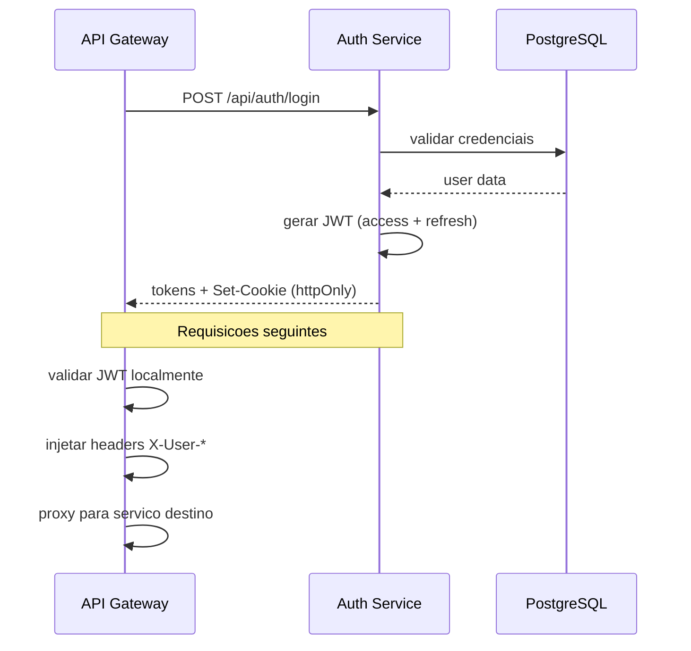
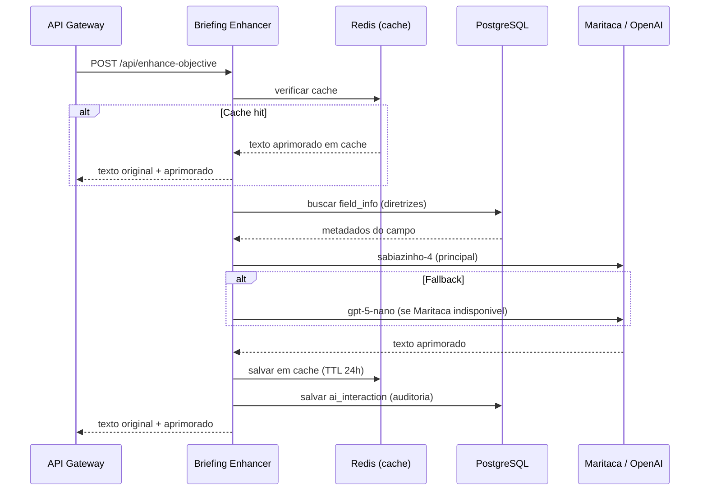
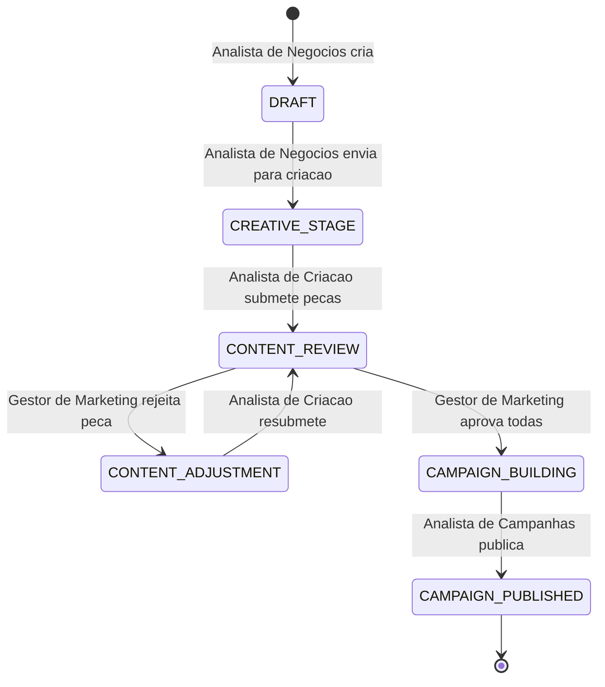
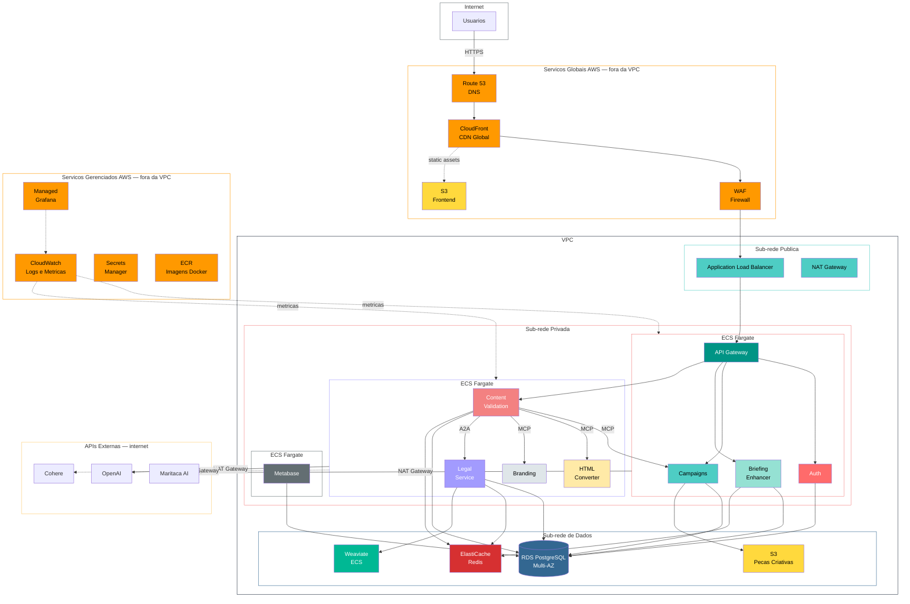

# Diagrama da Solução Orqestra — Estado Atual

> **Nota:** O frontend (React SPA) não é detalhado neste documento. O foco é a arquitetura de backend, serviços de IA e infraestrutura.

## Arquitetura Geral

> O diagrama visual completo está disponível em `assets/arquitetura_orqestra.png`.



**Conexões de dados** (omitidas do diagrama para clareza):
- **PostgreSQL** ← Auth, Campaigns, Briefing Enhancer, Content Validation, Legal Service, Metabase
- **Redis** ← Legal Service (DB 0), Content Validation (DB 1), Briefing Enhancer (DB 2)
- **S3** ← Campaigns (upload/download de peças)
- **Prometheus** ← coleta métricas de todos os serviços → Grafana

## Protocolos de Comunicacao



## Fluxo de Validacao de Conteudo



## Fluxo de Autenticacao



## Fluxo de Aprimoramento de Briefing



## Fluxo de Ciclo de Vida da Campanha



## Bancos de Dados

```mermaid
erDiagram
    auth_service {
        users PK
        refresh_tokens FK
        login_audits FK
    }
    campaigns_service {
        campaigns PK
        comments FK
        creative_pieces FK
        piece_review FK
        piece_review_event FK
        campaign_status_event FK
        channel_specs PK
    }
    briefing_enhancer {
        enhanceable_fields PK
        ai_interactions FK
    }
    content_validation {
        piece_validation_audit PK
    }
    legal_service {
        legal_validation_audits PK
    }
    metabase {
        metabase_internal string
    }
```

## Estrategia de Cache (Redis)

| Servico | Redis DB | TTL | Chave | Proposito |
|---------|----------|-----|-------|-----------|
| Legal Service | DB 0 | 1h | `legal:{channel}:{content_hash}` | Cache de validacoes regulatorias |
| Content Validation | DB 1 | 24h | `validation:{campaign_id}:{channel}:{content_hash}` | Cache de resultados completos de validacao |
| Briefing Enhancer | DB 2 | 24h | `enhancement:{user}:{field}:{text_hash}` | Cache de textos aprimorados |

Todos os servicos mantêm registros permanentes de auditoria em PostgreSQL, independente do cache Redis.

## Mapa de Portas

| Servico | Porta | Protocolo | Descricao |
|---------|-------|-----------|-----------|
| API Gateway | 8000 | REST | Roteamento + JWT + Rate Limit |
| Briefing Enhancer | 8001 | REST | Aprimoramento de briefing com IA |
| Auth Service | 8002 | REST | Autenticacao e autorizacao |
| Campaigns Service | 8003 | REST + MCP | Gestao de campanhas e pecas |
| Content Validation | 8004 | REST + A2A | Orquestracao de validacao (LangGraph) |
| Legal Service | 8005 | REST + A2A | Validacao regulatoria (RAG) |
| HTML Converter | 8011 | MCP | Conversao HTML para imagem (Java) |
| Branding Service | 8012 | MCP | Validacao de marca (deterministico) |
| PostgreSQL | 5432 | SQL | 6 databases (auth, campaigns, briefing, content-validation, legal, metabase) |
| LocalStack S3 | 4566 | S3 API | Armazenamento de arquivos (email HTML, imagens app) |
| Weaviate | 8080 / 50051 | HTTP / gRPC | Base vetorial — documentos regulatorios |
| Redis | 6379 | Redis | Cache — DB 0 (Legal), DB 1 (Content Validation), DB 2 (Briefing Enhancer) |
| Prometheus | 9090 | HTTP | Coleta de metricas |
| Grafana | 3001 | HTTP | Dashboards tecnicos |
| Metabase | 3002 | HTTP | Dashboards de negocio |

## Comunicacao Entre Servicos

| Origem | Destino | Protocolo | Proposito |
|--------|---------|-----------|-----------|
| API Gateway | Auth Service | REST | Roteamento /api/auth/* |
| API Gateway | Campaigns Service | REST | Roteamento /api/campaigns/* |
| API Gateway | Briefing Enhancer | REST | Roteamento /api/enhance-objective, /api/ai-interactions |
| API Gateway | Content Validation | REST | Roteamento /api/ai/analyze-piece |
| Campaigns Service | Auth Service | REST | Validacao de token |
| Briefing Enhancer | Auth Service | REST | Validacao de token |
| Content Validation | Auth Service | REST | Validacao de token |
| Content Validation | Campaigns Service | MCP | retrieve_piece_content, get_channel_specs |
| Content Validation | HTML Converter | MCP | convert_html_to_image |
| Content Validation | Branding Service | MCP | validate_email_brand, validate_image_brand, get_brand_guidelines |
| Content Validation | Legal Service | A2A | VALIDATE_COMMUNICATION |
| Legal Service | Weaviate | HTTP/gRPC | Hybrid search (RAG — chunking semantico) |
| Legal Service | Redis | Redis | Cache de validacoes (DB 0, TTL 1h) |
| Content Validation | Redis | Redis | Cache de resultados (DB 1, TTL 24h) |
| Briefing Enhancer | Redis | Redis | Cache de aprimoramentos (DB 2, TTL 24h) |
| Campaigns Service | LocalStack S3 | S3 API | Upload/download de arquivos |

## LLMs e APIs Externas

| Servico | Provedor | Modelo | Uso |
|---------|----------|--------|-----|
| Briefing Enhancer | Maritaca AI | sabiazinho-4 | Aprimoramento de texto (principal) |
| Briefing Enhancer | OpenAI | gpt-5-nano | Aprimoramento de texto (fallback) |
| Legal Service | Maritaca AI | sabiazinho-4 | Validacao regulatoria SMS/PUSH |
| Legal Service | OpenAI | gpt-5-nano | Validacao regulatoria EMAIL/APP (com imagem) |
| Legal Service | OpenAI | text-embedding-3-small | Embeddings para RAG |
| Legal Service | Cohere | Rerank v3 | Reranking (desabilitado — degradou recall nos experimentos) |

> **Nota:** O Content Validation Service nao invoca LLMs diretamente. Ele orquestra chamadas a servicos especializados (Legal, Branding, HTML Converter, Campaigns) via LangGraph.

## Perfis de Usuario

| Perfil | Permissoes |
|--------|-----------|
| Analista de Negocios | Cria campanhas, edita briefing, movimenta status, visualiza |
| Analista de Criacao | Submete pecas criativas, solicita validacao IA, submete para revisao |
| Analista de Campanhas | Visualiza campanhas, faz download de pecas |
| Gestor de Marketing | Aprova/rejeita pecas, solicita validacao IA adicional, veredito final |

## Tecnologias

- **Backend**: FastAPI (Python 3.11+), Spring Boot (Java — HTML Converter)
- **Frontend**: React 18, TypeScript, Vite, Tailwind CSS (detalhamento fora deste documento)
- **IA/ML**: LangGraph, LangChain, OpenAI API, Maritaca AI API
- **Banco de Dados**: PostgreSQL 16 (6 databases)
- **Vetorial**: Weaviate 1.29 (hybrid search, embeddings OpenAI, chunking semantico)
- **Cache**: Redis 7 (3 databases isolados por servico)
- **Storage**: LocalStack S3
- **Observabilidade**: Prometheus, Grafana (tecnico), Metabase (negocio)
- **Orquestracao**: Docker Compose
- **Autenticacao**: JWT (httpOnly cookies)
- **Protocolos**: REST, MCP (Model Context Protocol), A2A (Agent-to-Agent)

---

## Arquitetura de Producao (AWS)



### Decisoes de Arquitetura AWS

| Componente Local | Equivalente AWS | Justificativa |
|-----------------|----------------|---------------|
| Docker Compose | **ECS Fargate** | Serverless containers, sem gerenciar EC2 |
| PostgreSQL (container) | **RDS PostgreSQL Multi-AZ** | Alta disponibilidade, backups automaticos |
| Redis (container) | **ElastiCache Redis** | Gerenciado, replicacao automatica |
| LocalStack S3 | **S3** | Servico nativo, sem mudanca de codigo |
| Weaviate (container) | **Weaviate em ECS ou EC2** | Sem equivalente gerenciado AWS; EC2 com EBS para persistencia |
| Frontend (container Vite) | **S3 + CloudFront** | SPA servida como static assets via CDN |
| Prometheus + Grafana | **CloudWatch + Amazon Managed Grafana** | Gerenciados, sem manutencao |
| Metabase (container) | **Metabase em ECS Fargate** | Mantem a ferramenta, mas gerenciado |
| `.env` files | **Secrets Manager** | Rotacao automatica de segredos, auditoria |
| Rede Docker default | **VPC com sub-redes publica/privada** | Segregacao real de rede |
| — | **WAF** | Protecao contra ataques web (OWASP top 10) |
| — | **Route 53 + CloudFront** | DNS gerenciado + CDN + HTTPS automatico |
| — | **ECR** | Registro privado de imagens Docker |

### Seguranca de Rede

```
Internet
  |
  v
+-----------------------------+
|  Sub-rede Publica           |
|  - ALB (porta 443)          |
|  - NAT Gateway (saida)      |
+----------+------------------+
           | Security Group: apenas ALB -> ECS
           v
+-----------------------------+
|  Sub-rede Privada           |
|  - ECS Fargate (servicos)   |
|  - Sem IP publico           |
|  - Saida via NAT Gateway    |
+----------+------------------+
           | Security Group: apenas ECS -> Data
           v
+-----------------------------+
|  Sub-rede de Dados          |
|  - RDS PostgreSQL           |
|  - ElastiCache Redis        |
|  - Weaviate (EC2/ECS)       |
|  - Sem acesso a internet    |
+-----------------------------+
```
