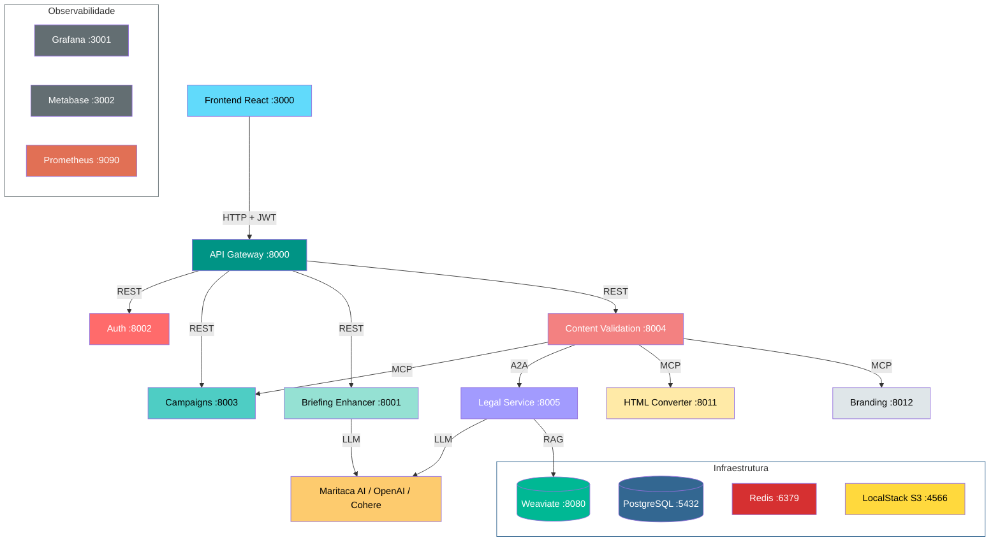

# Orqestra

Plataforma de gerenciamento de campanhas de CRM com validação automatizada de conteúdo. Combina microserviços REST, agentes baseados em LangGraph, comunicação via MCP (Model Context Protocol) e A2A (Agent-to-Agent Protocol).

> [!IMPORTANT]
> **Documentação completa:** [`dm_orqestra-ana-silva.pdf`](./dm_orqestra-ana-silva).
> Consulte a documentação em anexo para explicações sobre a Arquitetura do projeto, funcionalidades, detalhes da implementação, justificativas detalhadas e melhorias futuras.

## Arquitetura



## Serviços

| Serviço | Porta | O que faz |
|---|---|---|
| **API Gateway** | 8000 | Proxy reverso com autenticação JWT e rate limiting |
| **Auth Service** | 8002 | Registro, login, tokens JWT (access + refresh) |
| **Campaigns Service** | 8003 | CRUD de campanhas, peças criativas, upload S3. Expõe MCP tools |
| **Briefing Enhancer** | 8001 | Aprimora objetivos de campanha via LLM (LangGraph) |
| **Content Validation** | 8004 | Orquestra validação de peças: formato, specs, branding (MCP) e compliance (A2A) |
| **Legal Service** | 8005 | Validação jurídica via RAG (Weaviate + LangGraph). Expõe A2A |
| **Branding Service** | 8012 | Validação determinística de marca (cores, fontes, logo). Expõe MCP tools |
| **HTML Converter** | 8011 | Converte HTML de email em imagem (Spring Boot). Expõe MCP tool |
| **Frontend** | 3000 | Interface React + TypeScript + Vite + Tailwind |

### Protocolos de comunicação

- **REST**: Gateway roteia para Auth, Campaigns, Briefing Enhancer e Content Validation
- **MCP (Model Context Protocol)**: Content Validation consome tools de Campaigns, Branding e HTML Converter
- **A2A (Agent-to-Agent Protocol)**: Content Validation envia peças ao Legal Service para parecer jurídico

## Pré-requisitos

- Docker e Docker Compose
- Chave da OpenAI (`OPENAI_API_KEY`)
- Recomendado: chave da Maritaca (`MARITACA_API_KEY`) para a configuração de LLM com melhor accuracy

## Execução

### 1. Configurar variáveis de ambiente

```bash
cp .env.example .env
```

Edite o `.env` com suas chaves. Apenas `OPENAI_API_KEY` é obrigatória. Veja `.env.example` para detalhes sobre cada variável.

### 2. Subir os serviços

```bash
docker compose up -d
```

Isso inicia todos os containers, executa as migrations (Alembic) e carrega os dados pré-processados no Weaviate.

### 3. Acessar

| Recurso | URL |
|---|---|
| Frontend | http://localhost:3000 |
| API Gateway (Swagger) | http://localhost:8000/docs |
| Grafana | http://localhost:3001 (admin / orqestra) |
| Metabase | http://localhost:3002 |
| Prometheus | http://localhost:9090 |

### Usuário padrão

O seed cria um usuário para testes:

```
Email: ana@email.com
Senha: 123
```

## Infraestrutura

| Componente | Porta | Uso |
|---|---|---|
| PostgreSQL | 5432 | Banco principal (um database por serviço) |
| Redis | 6379 | Cache de validações e enhancements (DB 0, 1, 2) |
| Weaviate | 8080 | Vector database para RAG do Legal Service |
| LocalStack (S3) | 4566 | Armazenamento de peças criativas (email HTML, imagens app) |

## Comandos úteis

```bash
# Ver logs de um serviço
docker compose logs -f legal-service

# Parar tudo
docker compose down

# Parar e limpar volumes (reset completo)
docker compose down -v

# Rebuild de um serviço
docker compose build content-validation-service
docker compose up -d content-validation-service
```

## Estrutura do repositório

```
├── api-gateway/                  Proxy reverso (FastAPI)
├── auth-service/                 Autenticação JWT (FastAPI)
├── briefing-enhancer-service/    Aprimoramento de briefings (LangGraph)
├── campaigns-service/            Gestão de campanhas + MCP server (FastAPI)
├── content-validation-service/   Orquestrador de validação (LangGraph)
├── legal-service/                Validação jurídica RAG + A2A (LangGraph)
├── branding-service/             Validação de marca via MCP (FastAPI)
├── html-converter-service/       HTML para imagem + MCP (Spring Boot)
├── frontend/                     SPA React + TypeScript
├── documents-ingestion/          Pipeline de ingestão de PDFs no Weaviate
├── monitoring/                   Prometheus, Grafana, Metabase
├── postman-collections/          Collection Postman com todos os endpoints
├── docker-compose.yml            Orquestração de todos os serviços
└── .env.example                  Variáveis de ambiente necessárias
```
