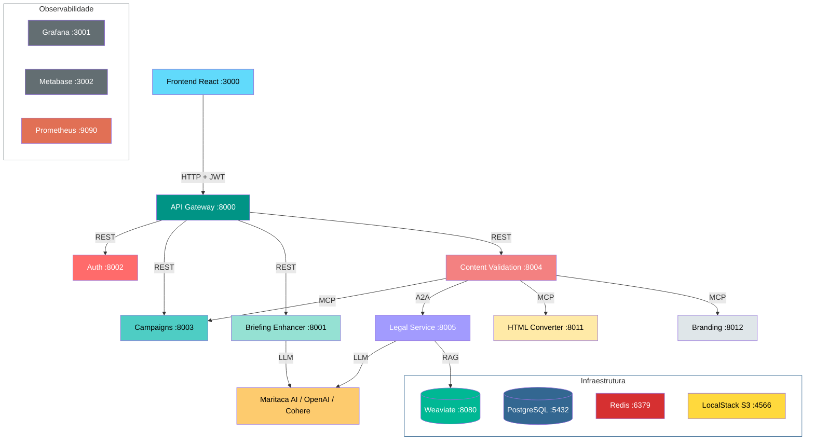

# Orqestra

Plataforma de gerenciamento de campanhas de CRM com validação automatizada de conteúdo. Combina microserviços REST, agentes baseados em LangGraph, comunicação via MCP (Model Context Protocol) e A2A (Agent-to-Agent Protocol).

# Acesse a documentação (PDF)
> [!IMPORTANT]
> **Documentação completa:** [`dm_orqestra-ana-silva.pdf`](dm-orqestra-ana-silva.pdf).
> Consulte a documentação em anexo para explicações sobre a Arquitetura do projeto, funcionalidades, detalhes da implementação, justificativas detalhadas e melhorias futuras.

## Arquitetura



## Docker Compose — todos os services

| Service | Porta | Tipo | O que faz |
|---|---|---|---|
| `frontend` | 3000 | Aplicação | Interface React + TypeScript + Vite + Tailwind |
| `api-gateway` | 8000 | Aplicação | Proxy reverso com autenticação JWT e rate limiting |
| `auth-service` | 8002 | Aplicação | Registro, login, tokens JWT (access + refresh) |
| `campaigns-service` | 8003 | Aplicação | CRUD de campanhas, peças criativas, upload S3. Expõe MCP tools |
| `briefing-enhancer-service` | 8001 | Aplicação | Aprimora objetivos de campanha via LLM (LangGraph) |
| `content-validation-service` | 8004 | Aplicação | Orquestra validação de peças: formato, specs, branding (MCP) e compliance (A2A) |
| `legal-service` | 8005 | Aplicação | Validação jurídica via RAG (Weaviate + LangGraph). Expõe A2A |
| `branding-service` | 8012 | Aplicação | Validação determinística de marca (cores, fontes, logo). Expõe MCP tools |
| `html-converter-service` | 8011 | Aplicação | Converte HTML de email em imagem (Spring Boot). Expõe MCP tool |
| `db` | 5432 | Infraestrutura | PostgreSQL 16 — banco principal (um database por serviço) |
| `redis` | 6379 | Infraestrutura | Cache de validações e enhancements (DB 0, 1, 2) |
| `weaviate` | 8080 | Infraestrutura | Vector database para RAG do Legal Service |
| `localstack` | 4566 | Infraestrutura | S3 local para armazenamento de peças criativas |
| `documents-ingestion` | — | Pipeline offline | Chunking e embedding de PDFs jurídicos. Gera os JSONs carregados pelo weaviate-init. O sistema já sobe com os documentos carregados, então não é necessário executar documents-ingestion. |
| `weaviate-init` | — | Init job | Cria coleção e carrega documentos jurídicos pré-processados no Weaviate |
| `metabase-db-init` | — | Init job | Cria o database `metabase` no PostgreSQL |
| `metabase-init` | — | Init job | Provisiona dashboards, conexões e queries SQL no Metabase |
| `prometheus` | 9090 | Observabilidade | Coleta métricas de todos os serviços |
| `grafana` | 3001 | Observabilidade | Dashboards de métricas em tempo real (admin / orqestra) |
| `metabase` | 3002 | Observabilidade | Dashboards analíticos sobre dados de negócio (admin@orqestra.com / Orqestra2026!) |

### Protocolos de comunicação

- **REST**: Gateway roteia para Auth, Campaigns, Briefing Enhancer e Content Validation
- **MCP (Model Context Protocol)**: Content Validation consome tools de Campaigns, Branding e HTML Converter
- **A2A (Agent-to-Agent Protocol)**: Content Validation envia peças ao Legal Service para parecer jurídico

## Pré-requisitos

- Docker e Docker Compose - Obrigatório
- Chave da Maritaca AI (`MARITACA_API_KEY`) - Recomendado, mas se não for informado, um modelo da OpenAI será utilizado como fallback.
- Chave da OpenAI (`OPENAI_API_KEY`) - Obrigatório
- Chave da Cohere (`COHERE_APIKEY`) - Opcional se desejar usar rerank (desabilitado por padrão) ou executar a ingestão de documentos documents-ingestion (não é necessário pois a base vetorial já é carregada na subida).

## Execução

### 1. Configurar variáveis de ambiente

```bash
cp .env.example .env
```

Edite o `.env` com suas chaves. Apenas `OPENAI_API_KEY` é obrigatória. Veja `.env.example` para detalhes sobre cada variável.

### 2. Subir os serviços

```bash
docker compose up --build
```

Isso inicia todos os containers, executa as migrations (Alembic) e carrega os dados pré-processados no Weaviate.

### 3. Acessar

| Recurso | URL |
|---|---|
| Frontend | http://localhost:3000 |
| API Gateway (Swagger) | http://localhost:8000/docs |
| Grafana | http://localhost:3001 (admin / orqestra) |
| Metabase | http://localhost:3002 (admin@orqestra.com / Orqestra2026!) |
| Prometheus | http://localhost:9090 |

> **Nota:** O Metabase pode levar de 1 a 3 minutos para ficar disponível na primeira execução. Enquanto não estiver pronto, `http://localhost:3002` retornará erro de conexão.

### Usuários para testes

**Analista de negócios**
```
Email: ana@email.com
Senha: 123
```


**Analista de criação**
```
Email: maria@email.com
Senha: 123
```


**Gestor de marketing**
```
Email: eric@email.com
Senha: 123
```


**Analista de campanhas**
```
Email: jose@email.com
Senha: 123
```


## Testes unitários

Os testes rodam dentro dos containers (não executam automaticamente na subida). Para executar:

```bash
# Rodar testes de um serviço específico
docker compose exec auth-service pytest tests/ -v
docker compose exec campaigns-service pytest tests/ -v
docker compose exec content-validation-service pytest tests/ -v
docker compose exec legal-service pytest tests/ -v
docker compose exec branding-service pytest tests/ -v

# Frontend (Vitest)
docker compose exec frontend pnpm test
```

| Serviço | O que testa |
|---|---|
| auth-service | Hashing de senha (bcrypt), geração/validação JWT, rate limiting |
| branding-service | Validação de cores (threshold 50%), parsing HTML, detecção de fontes |
| legal-service | Construção de prompts, parsing de resposta LLM, fallback de provider |
| content-validation-service | Validação de specs (limites de caracteres, dimensões), construção do veredito |
| campaigns-service | Transições de status por papel, visibilidade, lógica de aprovação IA + humano |
| frontend | Utilitários (merge de classes Tailwind) |

## Comandos úteis

```bash
# Build e subir todos os serviços
docker compose up --build

# Ver logs de um serviço específico
docker compose logs -f legal-service

# Parar tudo
docker compose down

# Parar e limpar volumes (reset completo)
docker compose down -v

# Rebuild de um serviço
docker compose build content-validation-service
docker compose up -d content-validation-service
```

## Estrutura do repositório

```
├── api-gateway/                  Proxy reverso (FastAPI)
├── auth-service/                 Autenticação JWT (FastAPI)
├── briefing-enhancer-service/    Aprimoramento de briefings (LangGraph)
├── campaigns-service/            Gestão de campanhas + MCP server (FastAPI)
├── content-validation-service/   Orquestrador de validação (LangGraph)
├── legal-service/                Validação jurídica RAG + A2A (LangGraph)
├── branding-service/             Validação de marca via MCP (FastAPI)
├── html-converter-service/       HTML para imagem + MCP (Spring Boot)
├── frontend/                     SPA React + TypeScript
├── documents-ingestion/          Pipeline de ingestão de PDFs no Weaviate
├── monitoring/                   Prometheus, Grafana, Metabase
├── postman-collections/          Collection Postman com todos os endpoints
├── docker-compose.yml            Orquestração de todos os serviços
└── .env.example                  Variáveis de ambiente necessárias
```
