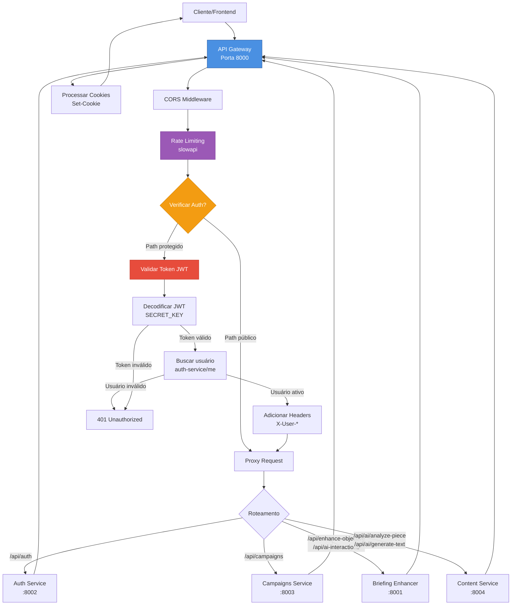
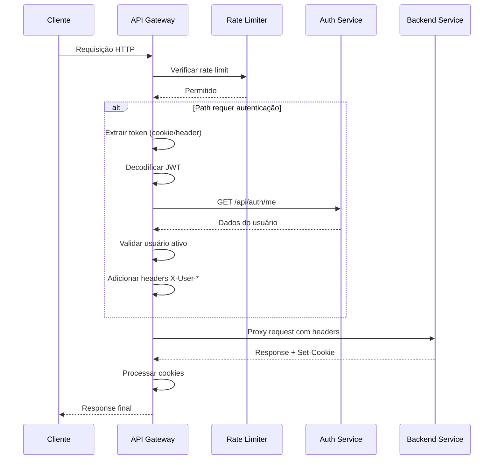
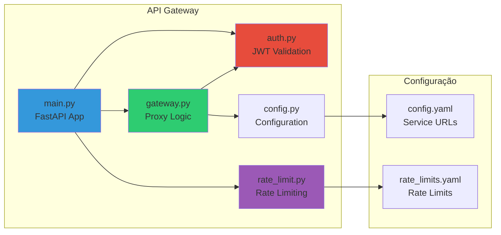
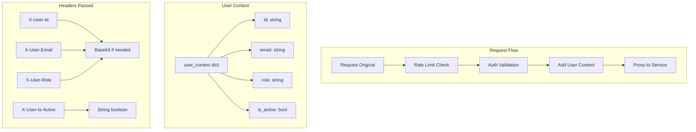

# API Gateway - Diagrama e Funcionalidades

## Diagrama de Arquitetura



## Fluxo de Requisição



## Componentes Internos



## Funcionalidades Implementadas

### 1. **Roteamento de Requisições**
- Roteamento baseado em path prefix
- Suporte a múltiplos serviços backend
- Mapeamento de paths para serviços:
  - `/api/auth` → Auth Service (8002)
  - `/api/campaigns` → Campaigns Service (8003)
  - `/api/enhance-objective`, `/api/ai-interactions` → Briefing Enhancer (8001)
  - `/api/ai/analyze-piece`, `/api/ai/generate-text` → Content Service (8004)

### 2. **Autenticação Centralizada**
- Validação de tokens JWT no Gateway
- Decodificação de JWT usando SECRET_KEY compartilhada
- Verificação de usuário ativo via auth-service
- Extração de token de cookie ou header Authorization
- Paths públicos configuráveis (login, register, refresh, health)

### 3. **Contexto de Usuário via Headers**
- Passagem de contexto do usuário para serviços downstream
- Headers customizados:
  - `X-User-Id`: ID do usuário
  - `X-User-Email`: Email do usuário
  - `X-User-Role`: Role do usuário (com encoding base64 para caracteres não-ASCII)
  - `X-User-Is-Active`: Status de ativação
- Encoding base64 automático para valores não-ASCII

### 4. **Rate Limiting**
- Rate limiting por IP usando `slowapi`
- Configuração via YAML (`rate_limits.yaml`)
- Limites configuráveis:
  - Global (default): 100 req/min
  - Por serviço: auth (60), campaigns (80), briefing-enhancer (30), content (30)
  - Por path específico: login (10/min), register (5/hora)
- Detecção de IP real via `X-Forwarded-For`

### 5. **CORS (Cross-Origin Resource Sharing)**
- Middleware CORS configurável
- Suporte a credenciais (cookies)
- Configuração de origens permitidas

### 6. **Proxy HTTP Completo**
- Suporte a métodos: GET, POST, PUT, PATCH, DELETE, OPTIONS
- Preservação de headers originais
- Repasse de query parameters
- Timeout configurável (30s)
- Tratamento de erros:
  - 502 Bad Gateway (erro no proxy)
  - 503 Service Unavailable (serviço inacessível)
  - 504 Gateway Timeout (timeout)

### 7. **Gerenciamento de Cookies**
- Processamento automático de `Set-Cookie` dos serviços backend
- Parsing de atributos de cookie (httponly, path, samesite, max-age, secure)
- Repasse de cookies para o cliente

### 8. **Health Check**
- Endpoint `/api/health` com status dos serviços
- Endpoint `/` com informações básicas do Gateway

### 9. **Configuração Flexível**
- Configuração via YAML (`config.yaml`)
- Suporte a variáveis de ambiente
- Override de configuração via env vars

### 10. **Logging**
- Logging estruturado
- Logs de erro para troubleshooting
- Tratamento de exceções com stack trace

## Arquitetura de Dados



## Configuração de Rate Limits

```yaml
enabled: true
default:
  requests_per_minute: 100
services:
  auth: 60/min
  campaigns: 80/min
  briefing-enhancer: 30/min
  content: 30/min
paths:
  /api/auth/login: 10/min
  /api/auth/register: 5/hour
```

## Endpoints

### GET /api/health
Endpoint de health check que retorna status do serviço e URLs dos serviços backend configurados. Não requer autenticação.

**Resposta:**
```json
{
  "status": "ok",
  "service": "api-gateway",
  "services": {
    "auth": "http://auth-service:8002",
    "campaigns": "http://campaigns-service:8003",
    "briefing-enhancer": "http://briefing-enhancer-service:8001",
    "content": "http://content-service:8004"
  }
}
```

### GET /
Endpoint raiz que retorna informações básicas do Gateway (nome, versão, status). Não requer autenticação.

**Resposta:**
```json
{
  "service": "api-gateway",
  "version": "1.0.0",
  "status": "running"
}
```

### * /api/{path:path} (Catch-all)
Endpoint catch-all que faz proxy reverso para todos os serviços backend baseado no path da requisição. Suporta métodos HTTP: GET, POST, PUT, DELETE, PATCH, OPTIONS.

**Roteamento:**
- `/api/auth/*` → Auth Service (porta 8002)
- `/api/campaigns/*` → Campaigns Service (porta 8003)
- `/api/enhance-objective`, `/api/ai-interactions`, `/api/ai/*` → Briefing Enhancer Service (porta 8001)
- `/api/ai/analyze-piece`, `/api/ai/generate-text` → Content Service (porta 8004)
- Outros paths → Campaigns Service (default)

**Comportamento:**
- Aplica rate limiting baseado no path
- Valida autenticação para paths protegidos
- Adiciona headers `X-User-*` para serviços downstream
- Processa e repassa cookies dos serviços backend
- Preserva headers, query parameters e corpo da requisição

## Paths Públicos (sem autenticação)

- `/api/auth/login`
- `/api/auth/register`
- `/api/auth/refresh`
- `/api/health`
- `/`

## Paths Protegidos (requerem autenticação)

- Todos os outros paths sob `/api/*`
- Requerem token JWT válido
- Requerem usuário ativo

