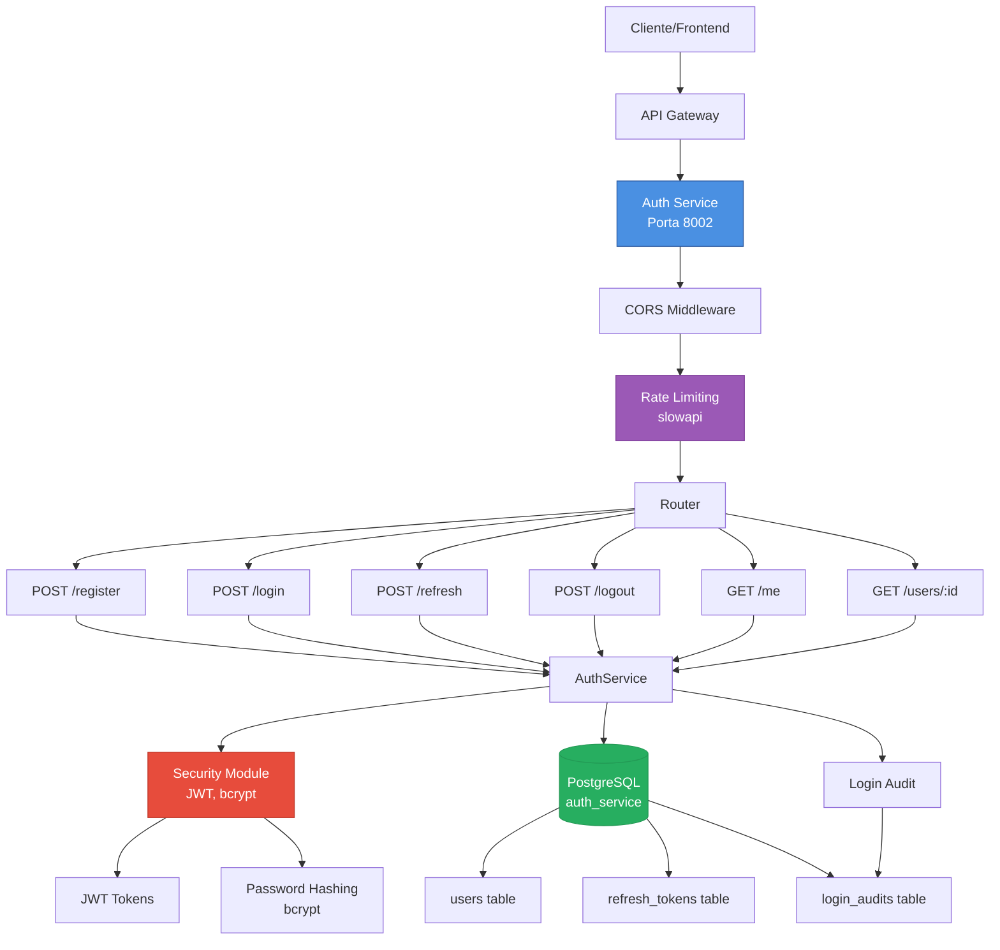
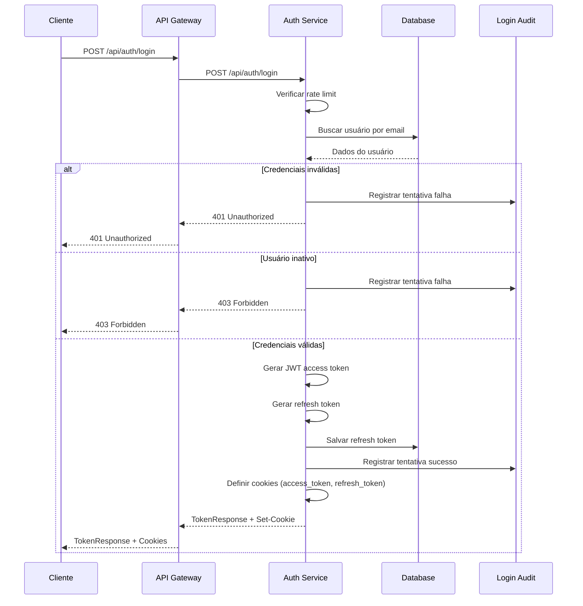
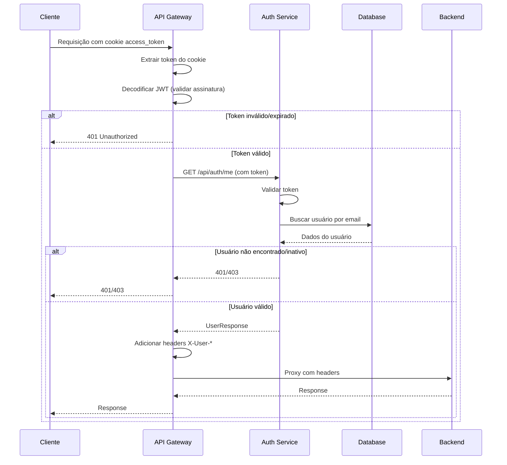
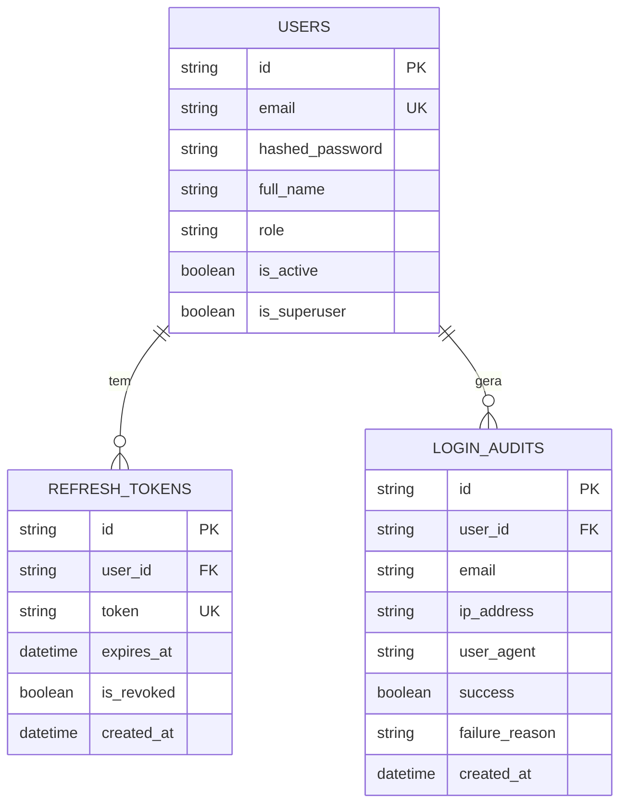
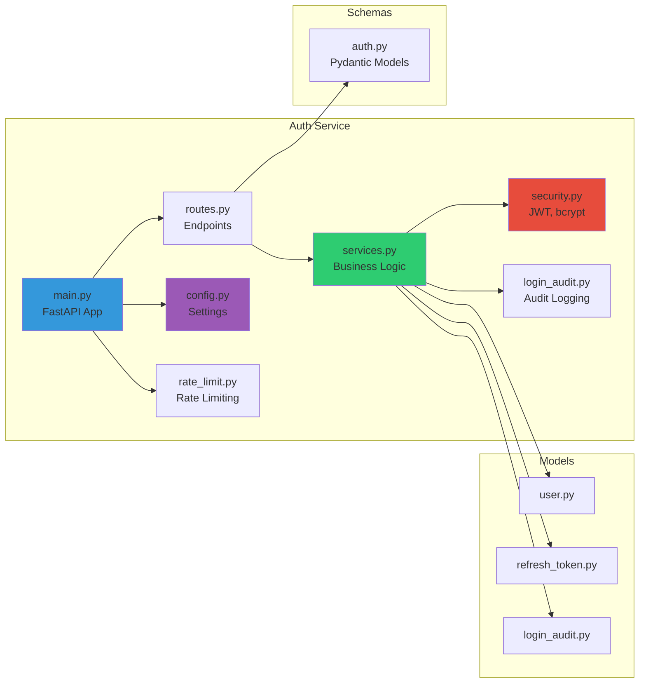
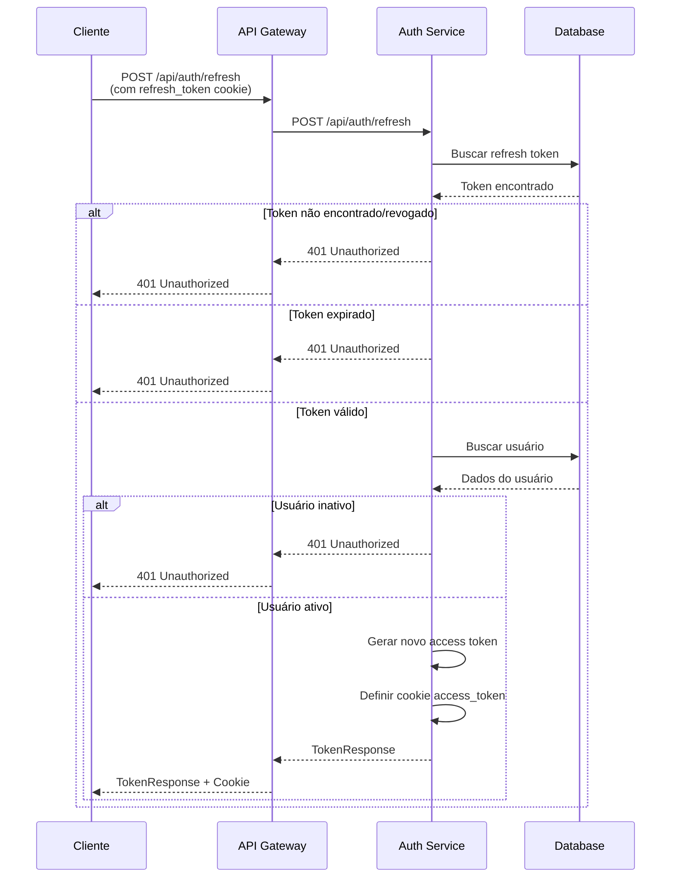
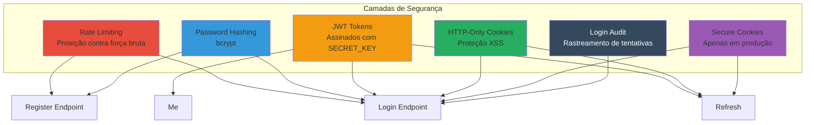

# Auth Service - Diagrama e Funcionalidades

## Funcionalidades

O Auth Service é responsável por toda a autenticação e gerenciamento de usuários do sistema Orqestra. Ele implementa autenticação baseada em JWT (JSON Web Tokens) com suporte a refresh tokens para renovação automática de sessões, garantindo que os usuários não precisem fazer login constantemente. O serviço gerencia o ciclo completo de autenticação, desde o registro de novos usuários até o logout e revogação de tokens. Durante o processo de login, todas as tentativas são auditadas em uma tabela dedicada, registrando informações como endereço IP, user-agent do navegador e resultado da tentativa (sucesso ou falha com motivo), proporcionando rastreabilidade completa para fins de segurança e monitoramento. O serviço também implementa rate limiting configurável para proteger contra ataques de força bruta, com limites específicos para login (50 requisições por minuto) e registro (5 requisições por hora), impedindo que atacantes tentem descobrir senhas através de tentativas massivas. Os tokens são armazenados em cookies HTTP-only com flag secure em produção, prevenindo acesso via JavaScript (proteção contra XSS) e garantindo transmissão apenas via HTTPS em ambientes de produção. O serviço suporta múltiplos roles de usuário através de um enum (Analista de negócios, Analista de criação, Analista de campanhas), permitindo controle de acesso baseado em permissões. Além disso, o serviço fornece endpoints para consulta de informações de usuários, permitindo que outros serviços do sistema obtenham dados de usuários específicos quando necessário, como no caso do campaigns-service que busca informações do criador de campanhas para exibição na interface. A senha dos usuários é armazenada usando hash bcrypt, garantindo que mesmo em caso de vazamento do banco de dados, as senhas não possam ser recuperadas em texto plano. O serviço também implementa validação de usuários ativos, impedindo que contas desativadas façam login no sistema.

## Endpoints

### POST /api/auth/register
Registra um novo usuário no sistema. Aceita email, senha, nome completo e role opcional. Valida se o email já está cadastrado e cria o usuário com senha hasheada usando bcrypt. Rate limit: 5 requisições por hora.

### POST /api/auth/login
Autentica um usuário com email e senha. Retorna access token JWT e refresh token, armazenando ambos em cookies HTTP-only. Registra tentativa de login na auditoria. Valida se o usuário está ativo. Rate limit: 50 requisições por minuto.

### POST /api/auth/refresh
Renova o access token usando um refresh token válido. Valida se o refresh token não está revogado e não expirou. Atualiza os cookies com o novo access token. Se o refresh token for renovado, atualiza também o cookie do refresh token.

### POST /api/auth/logout
Revoga o refresh token do usuário e remove os cookies de autenticação. Requer autenticação (usuário deve estar logado).

### GET /api/auth/me
Retorna informações do usuário autenticado (id, email, nome, role, status ativo). Usado principalmente pelo API Gateway para validar tokens e obter contexto do usuário. Requer autenticação.

### GET /api/auth/users/{user_id}
Retorna informações de um usuário específico pelo ID. Usado por outros serviços (como campaigns-service) para obter dados de usuários. Requer autenticação.

### GET /api/health
Endpoint de health check que retorna status do serviço.

### GET /
Endpoint raiz que retorna informações básicas do serviço (nome, versão, status).

## Diagrama de Arquitetura

## Fluxo de Autenticação

## Fluxo de Validação de Token (API Gateway)

## Modelo de Dados

## Componentes Internos

## Fluxo de Refresh Token

## Segurança

