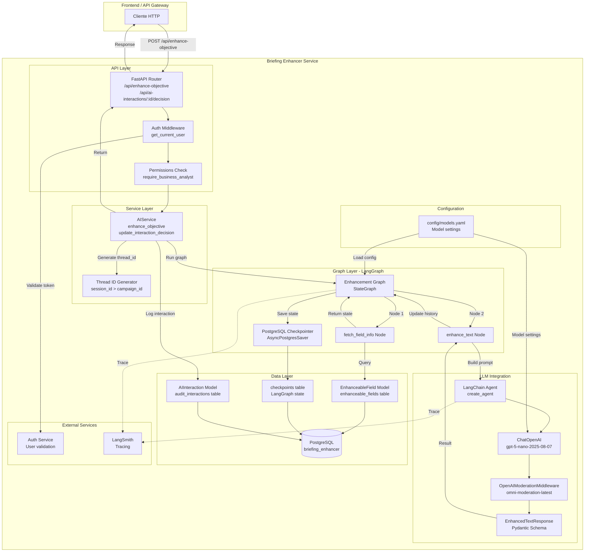
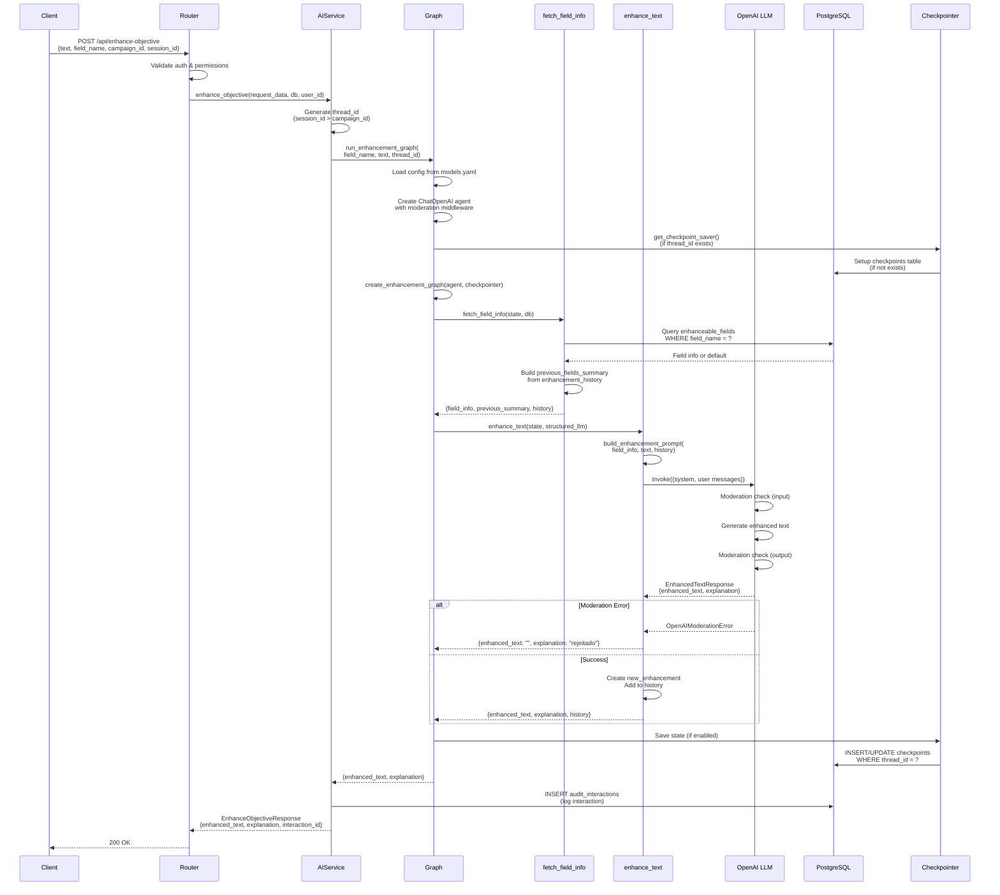
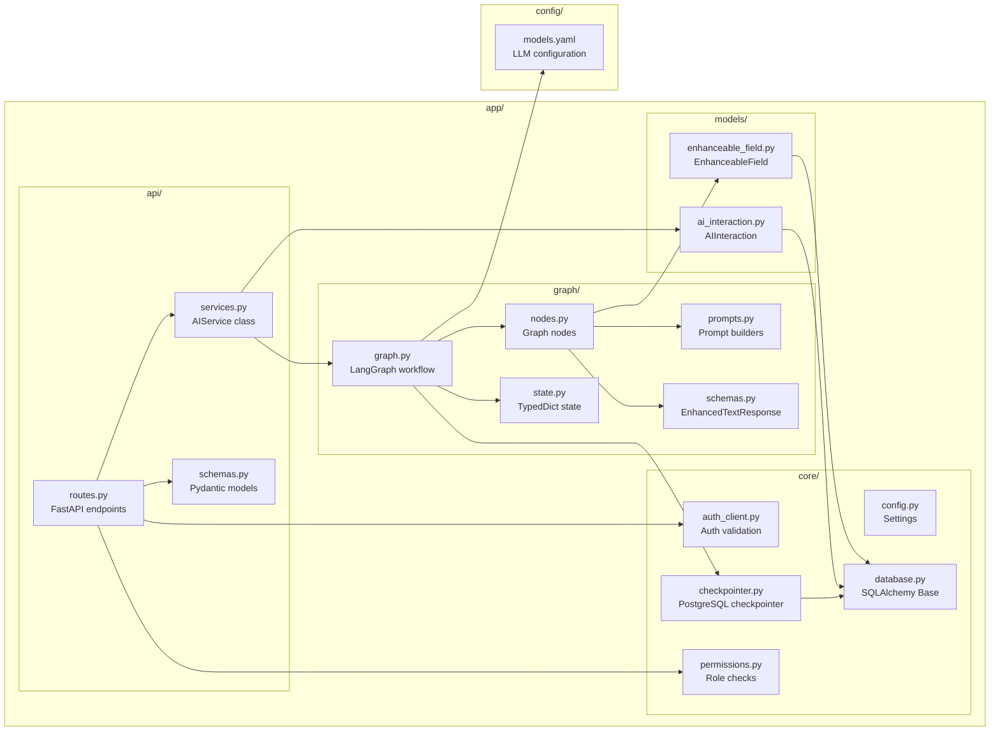
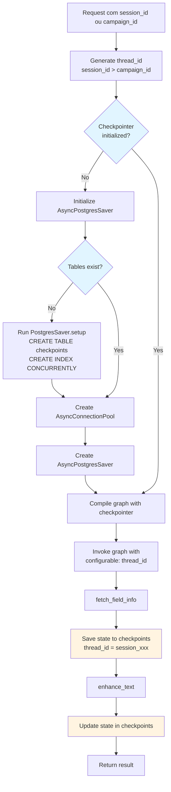
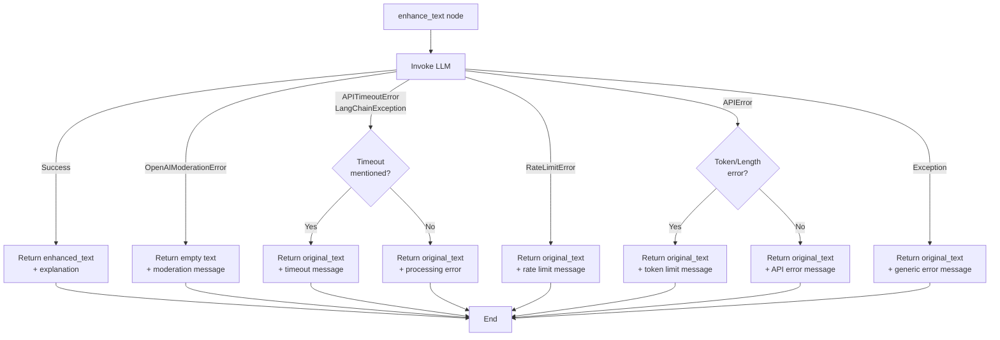
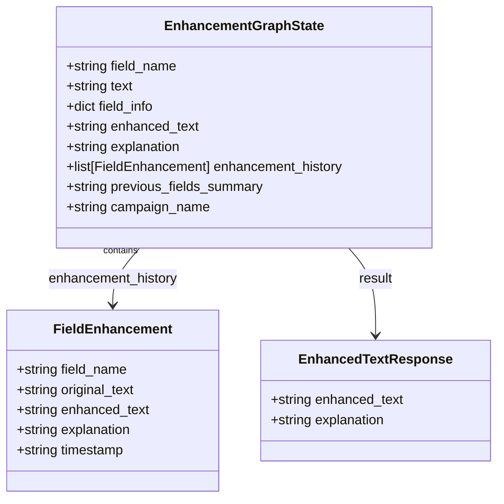

# Briefing Enhancer Service - Diagramas

## 1. Arquitetura e Fluxo do Serviço



## 2. Fluxo de Execução Detalhado



## 3. Estrutura de Componentes



## 4. Diagrama de Banco de Dados (ER)

```mermaid
erDiagram
    enhanceable_fields {
        string field_name PK "Primary Key"
        string display_name "NOT NULL"
        text expectations "NOT NULL"
        text improvement_guidelines "NULLABLE"
        timestamp created_at "NOT NULL, DEFAULT now()"
        timestamp updated_at "NOT NULL, DEFAULT now()"
    }
    
    audit_interactions {
        string id PK "UUID, Primary Key"
        string user_id "NOT NULL, Indexed"
        string campaign_id "NULLABLE, Indexed"
        string field_name "NOT NULL, Indexed"
        text input_text "NOT NULL"
        text output_text "NOT NULL"
        text explanation "NOT NULL"
        string session_id "NULLABLE, Indexed"
        string user_decision "NULLABLE, Indexed<br/>'approved' | 'rejected'"
        timestamp decision_at "NULLABLE"
        timestamp created_at "NOT NULL, DEFAULT now()"
    }
    
    checkpoints {
        thread_id string "Part of PK"
        checkpoint_ns string "Part of PK"
        checkpoint_id string "Part of PK"
        parent_checkpoint_id string "NULLABLE"
        checkpoint blob "JSON state"
        metadata jsonb "NULLABLE"
    }
    
    checkpoint_blobs {
        thread_id string "Part of PK"
        checkpoint_ns string "Part of PK"
        checkpoint_id string "Part of PK"
        channel string "Part of PK"
        version string "Part of PK"
        type string
        blob bytea
    }
    
    enhanceable_fields ||--o{ audit_interactions : "field_name references"
    
    note right of enhanceable_fields
        Campos configuráveis para aprimoramento:
        - businessObjective
        - expectedResult
        - targetAudienceDescription
        - exclusionCriteria
    end note
    
    note right of audit_interactions
        Audit log de todas as interações com IA.
        Permite rastrear:
        - Quem usou (user_id)
        - Quando (created_at)
        - Qual campo (field_name)
        - Input/Output
        - Decisão do usuário (approved/rejected)
    end note
    
    note right of checkpoints
        Tabelas criadas automaticamente
        pelo LangGraph para checkpointing.
        Armazena estado do grafo por thread_id.
    end note
```

## 5. Fluxo de Checkpointing



## 6. Tratamento de Erros



## 7. Estrutura de Dados do Estado (EnhancementGraphState)



## Tabelas do Banco de Dados

### enhanceable_fields
Armazena configurações de campos que podem ser aprimorados.

| Coluna | Tipo | Descrição |
|--------|------|-----------|
| `field_name` | VARCHAR(100) | PK - Nome técnico do campo |
| `display_name` | VARCHAR(200) | Nome de exibição |
| `expectations` | TEXT | O que se espera do campo |
| `improvement_guidelines` | TEXT | Diretrizes de melhoria |
| `created_at` | TIMESTAMP | Data de criação |
| `updated_at` | TIMESTAMP | Data de atualização |

**Campos pré-configurados:**
- `businessObjective` - Objetivo de Negócio
- `expectedResult` - Resultado Esperado / KPI Principal
- `targetAudienceDescription` - Descrição do Público-Alvo
- `exclusionCriteria` - Critérios de Exclusão

### audit_interactions
Registra todas as interações com IA para auditoria e análise.

| Coluna | Tipo | Descrição |
|--------|------|-----------|
| `id` | VARCHAR | PK - UUID |
| `user_id` | VARCHAR | ID do usuário (indexed) |
| `campaign_id` | VARCHAR | ID da campanha (indexed, nullable) |
| `field_name` | VARCHAR(100) | Nome do campo (indexed) |
| `input_text` | TEXT | Texto original |
| `output_text` | TEXT | Texto aprimorado |
| `explanation` | TEXT | Explicação do aprimoramento |
| `session_id` | VARCHAR | ID da sessão (indexed, nullable) |
| `user_decision` | VARCHAR(20) | Decisão: 'approved'/'rejected' (indexed, nullable) |
| `decision_at` | TIMESTAMP | Data da decisão (nullable) |
| `created_at` | TIMESTAMP | Data de criação (indexed) |

**Índices:**
- `ix_audit_interactions_user_id`
- `ix_audit_interactions_campaign_id`
- `ix_audit_interactions_field_name`
- `ix_audit_interactions_session_id`
- `ix_audit_interactions_user_campaign` (composite: user_id, campaign_id)
- `ix_audit_interactions_session` (session_id)
- `ix_audit_interactions_created_at`
- `ix_audit_interactions_user_decision`

### checkpoints (LangGraph)
Tabelas criadas automaticamente pelo LangGraph para checkpointing.

| Tabela | Descrição |
|--------|-----------|
| `checkpoints` | Armazena estados do grafo por thread_id |
| `checkpoint_blobs` | Armazena blobs grandes de estado |

**Estrutura checkpoints:**
- `thread_id` (PK) - Identificador da thread/sessão
- `checkpoint_ns` (PK) - Namespace
- `checkpoint_id` (PK) - ID do checkpoint
- `parent_checkpoint_id` - Checkpoint pai (para histórico)
- `checkpoint` - Estado serializado (JSON)
- `metadata` - Metadados adicionais (JSONB)

