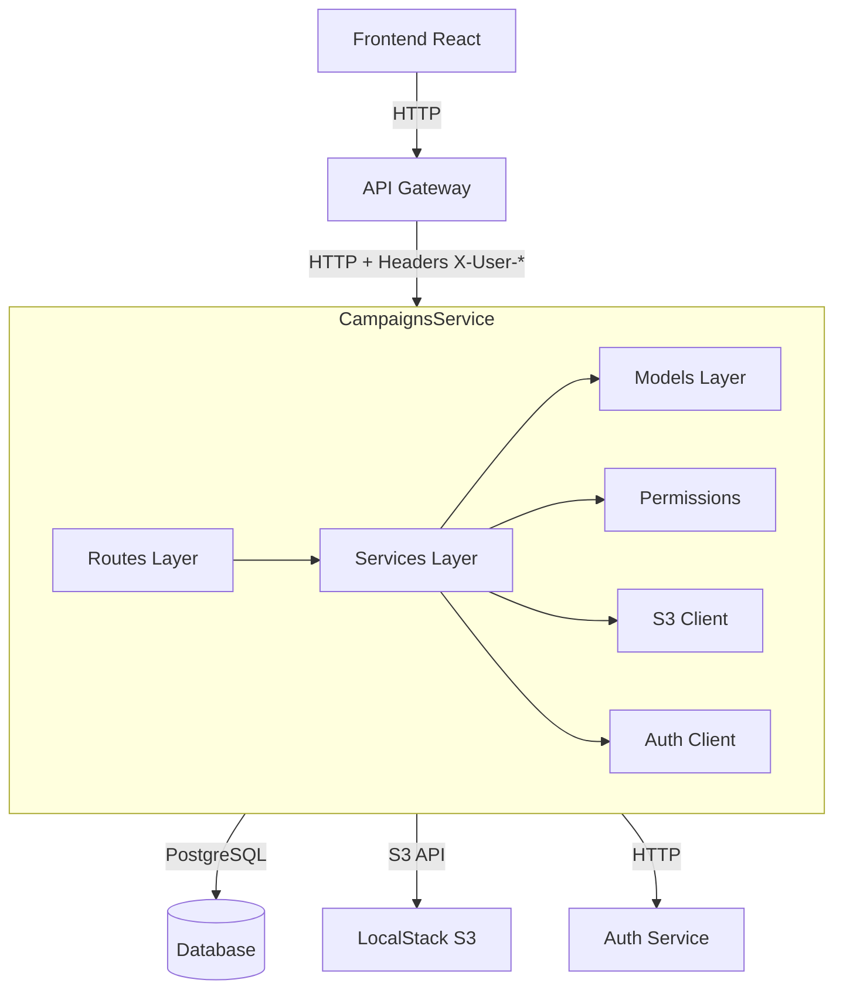
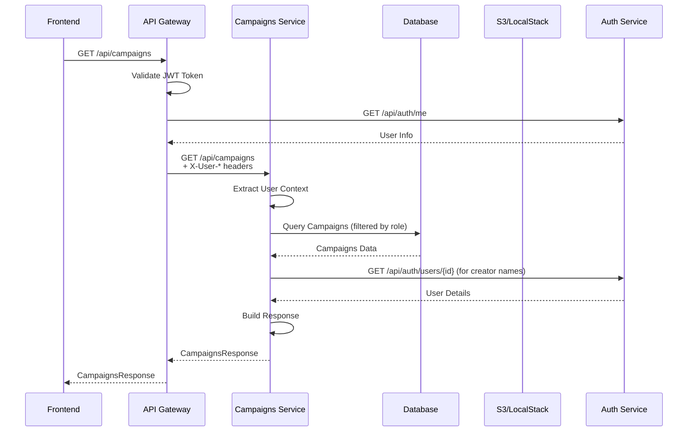
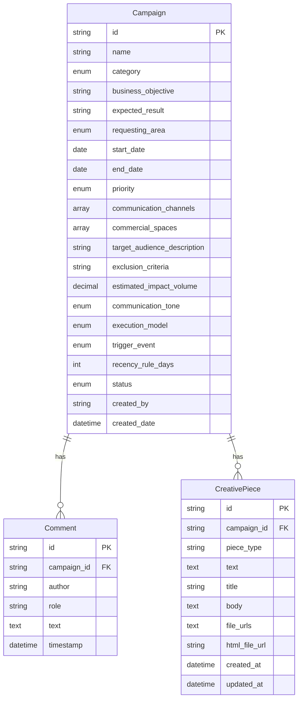
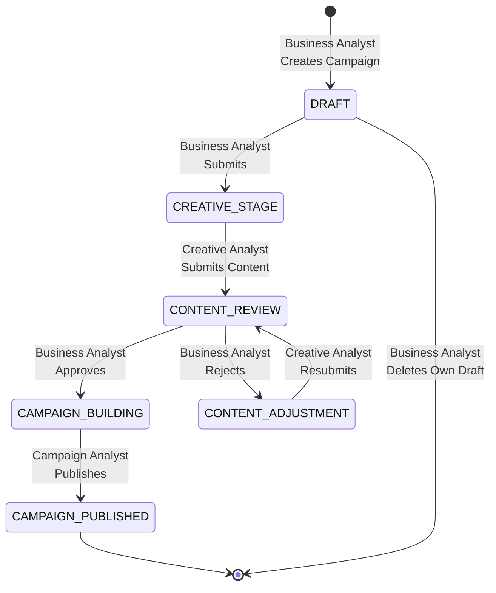
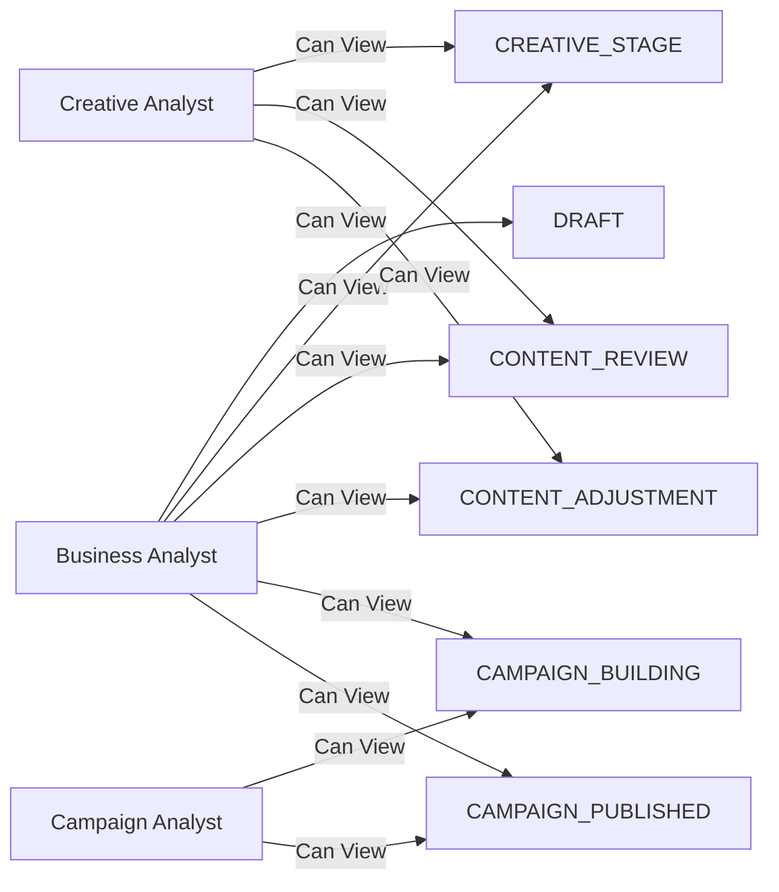
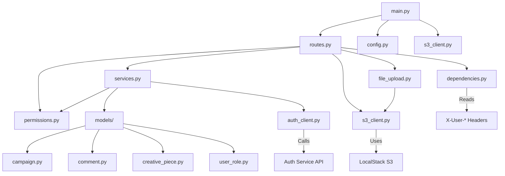

# Campaigns Service - Documentação

## Funcionalidades 

O Campaigns Service é responsável pelo gerenciamento completo do ciclo de vida das campanhas de CRM, abrangendo sua criação, atualização, exclusão e acompanhamento ao longo de diferentes fases e status. O serviço implementa um modelo de controle de acesso baseado em papéis, no qual cada tipo de usuário possui permissões e níveis de visibilidade específicos, definidos de acordo com o status atual da campanha. As campanhas são gerenciadas por meio de um workflow baseado em status, no qual cada transição é validada conforme regras de negócio e o papel do usuário que executa a ação. 
O serviço também permite que campanhas tenham comentários associados, viabilizando a comunicação entre diferentes papéis ao longo do processo de revisão e aprovação. Além disso, gerencia as peças criativas, que podem assumir quatro formatos distintos: SMS (texto simples), Push (título e corpo), App (arquivos PNG associados a espaços comerciais específicos) e E-mail (arquivos HTML). Os arquivos são armazenados em um bucket S3 (utilizando LocalStack no ambiente local) com visualização em tela.
São aplicadas validações específicas conforme o tipo de canal. Para campanhas de App, os arquivos devem estar no formato PNG e estar associados a espaços comerciais previamente definidos na campanha. Para campanhas de E-mail, apenas arquivos HTML válidos são aceitos, com validações adicionais para impedir o upload de formatos inadequados, como RTF. Sempre que um arquivo é substituído, a versão anterior é automaticamente removida do S3, garantindo consistência e evitando acúmulo de arquivos obsoletos. No caso das peças de App, múltiplos arquivos podem ser vinculados a uma única peça criativa, sendo organizados em uma estrutura JSON que mapeia cada espaço comercial à respectiva URL do arquivo.

## Lista de Endpoints

### Campanhas

1. **GET /api/campaigns**
   - Lista campanhas visíveis ao usuário baseado no seu role
   - Query params: `skip` (padrão: 0), `limit` (padrão: 100)
   - Response: `CampaignsResponse`
   - Autenticação: Requerida

2. **GET /api/campaigns/{campaign_id}**
   - Obtém uma campanha específica por ID
   - Response: `CampaignResponse`
   - Autenticação: Requerida

3. **POST /api/campaigns**
   - Cria uma nova campanha
   - Body: `CampaignCreate`
   - Response: `CampaignResponse` (201)
   - Autenticação: Requerida
   - Permissão: Apenas Analista de Negócios

4. **PUT /api/campaigns/{campaign_id}**
   - Atualiza uma campanha existente
   - Body: `CampaignUpdate`
   - Response: `CampaignResponse`
   - Autenticação: Requerida
   - Valida: Transições de status baseadas em role

5. **DELETE /api/campaigns/{campaign_id}**
   - Deleta uma campanha
   - Response: 204 No Content
   - Autenticação: Requerida
   - Permissão: Apenas Analista de Negócios, apenas próprios rascunhos (DRAFT)

### Comentários

6. **POST /api/campaigns/{campaign_id}/comments**
   - Adiciona um comentário a uma campanha
   - Body: `CommentCreate`
   - Response: `CommentResponse` (201)
   - Autenticação: Requerida

### Creative Pieces

7. **POST /api/campaigns/{campaign_id}/creative-pieces**
   - Submete uma peça criativa (SMS ou Push)
   - Body: `CreativePieceCreate`
   - Response: `CreativePieceResponse` (201)
   - Autenticação: Requerida
   - Permissão: Apenas Analista de Criação
   - Restrição: Campanha deve estar em CREATIVE_STAGE ou CONTENT_ADJUSTMENT

8. **POST /api/campaigns/{campaign_id}/creative-pieces/upload-app**
   - Faz upload de arquivo PNG para canal App
   - Form data: `commercial_space` (string), `file` (PNG)
   - Response: `CreativePieceResponse` (201)
   - Autenticação: Requerida
   - Permissão: Apenas Analista de Criação
   - Restrição: Campanha deve estar em CREATIVE_STAGE ou CONTENT_ADJUSTMENT

9. **POST /api/campaigns/{campaign_id}/creative-pieces/upload-email**
   - Faz upload de arquivo HTML para canal E-mail
   - Form data: `file` (HTML)
   - Response: `CreativePieceResponse` (201)
   - Autenticação: Requerida
   - Permissão: Apenas Analista de Criação
   - Restrição: Campanha deve estar em CREATIVE_STAGE ou CONTENT_ADJUSTMENT

10. **DELETE /api/campaigns/{campaign_id}/creative-pieces/app/{commercial_space}**
    - Deleta um arquivo App específico de um espaço comercial
    - Response: 204 No Content
    - Autenticação: Requerida
    - Permissão: Apenas Analista de Criação
    - Restrição: Campanha deve estar em CREATIVE_STAGE ou CONTENT_ADJUSTMENT

11. **DELETE /api/campaigns/{campaign_id}/creative-pieces/email**
    - Deleta o arquivo HTML do canal E-mail
    - Response: 204 No Content
    - Autenticação: Requerida
    - Permissão: Apenas Analista de Criação
    - Restrição: Campanha deve estar em CREATIVE_STAGE ou CONTENT_ADJUSTMENT

### Health Check

12. **GET /api/health**
    - Health check do serviço
    - Response: `{"status": "ok", "service": "campaigns-service"}`

## Diagramas Mermaid

### Arquitetura do Serviço

### Fluxo de Requisição

### Modelo de Dados

### Workflow de Status

### Permissões por Role

### Componentes Internos

